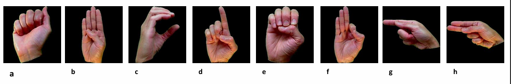
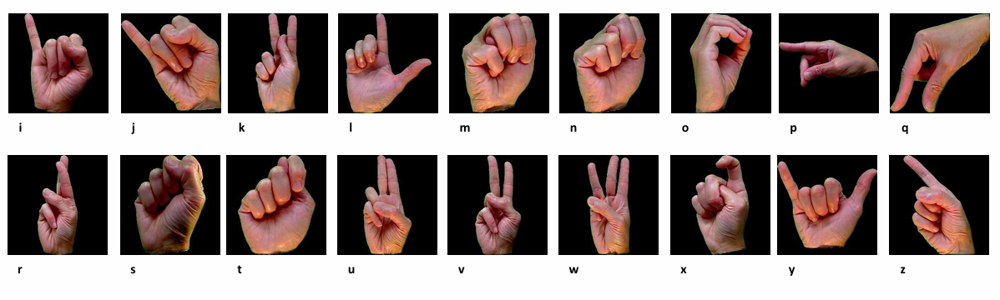
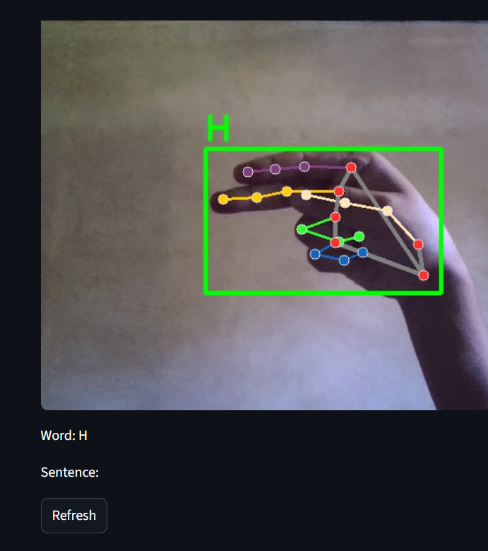
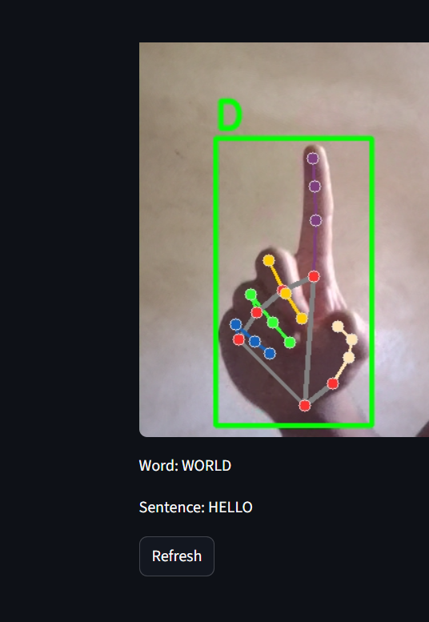
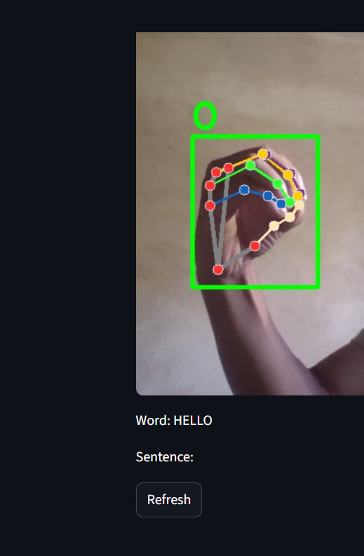
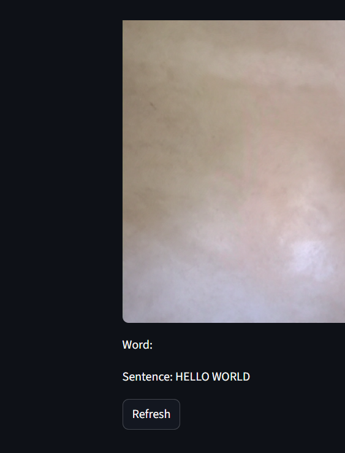

# Sign Language Detection using Hand Gestures

---

## 📝 Project Overview

This project is an **AI-powered real-time Sign Language Detection system** that translates hand gestures into readable **letters, words, and sentences**. It bridges communication gaps for the **hearing-impaired community** using **Computer Vision** and **Machine Learning** technologies.

The system leverages **MediaPipe** for hand landmark detection and a trained **Random Forest model** to recognize gestures corresponding to the **American Sign Language (ASL) alphabet**.

---

## ✨ Key Features

- **Real-Time Detection**: Captures hand gestures live using your webcam.  
- **Word & Sentence Construction**: Automatically builds words and sentences based on gesture timing.  
- **Interactive UI**: Streamlit app displays live video feed with detected letters and constructed text.  
- **Refresh Option**: Clear current word and sentence with a single button.  
- **Accurate Predictions**: Trained on a custom ASL dataset using MediaPipe landmarks for high accuracy.

---

## 🛠 Technologies Used

| Layer               | Technology / Library                  |
|--------------------|--------------------------------------|
| Frontend / UI       | Streamlit                             |
| Computer Vision     | OpenCV, MediaPipe                     |
| Machine Learning    | scikit-learn (Random Forest)          |
| Data Storage        | Pickle (for model & dataset)          |
| Programming         | Python 3.x                            |

---

## ⚙️ How It Works

### 1️⃣ Dataset Collection
- Images of hand gestures are processed using **MediaPipe** to extract **normalized hand landmarks**.

### 2️⃣ Model Training
- Hand landmarks are fed into a **Random Forest classifier**, trained to recognize letters **A-Z**.

### 3️⃣ Real-Time Detection
- The **Streamlit app** accesses the webcam, predicts the gesture, and displays it in real-time.

### 4️⃣ Word & Sentence Formation
- Waits a few seconds before adding the **first letter**.  
- Adds letters at **set intervals** if the hand gesture continues.  
- Moves completed words to a **sentence** when the hand is absent for a few seconds.

---


## User Manual

    ## User Manual

     ### 📝 Interactive Word & Sentence Input
            Our Sign Language Detection app intelligently constructs words and sentences in real-time from hand gestures. The system includes a smart timing mechanism for intuitive typing using gestures:

First Letter Input:

When a hand gesture is detected, the app waits 3 seconds before adding the first letter of a new word.

This ensures accidental hand movements are not misinterpreted as input.

Subsequent Letters:

Once the first letter is added, the app waits 2 seconds between letters.

This allows continuous hand gestures to form words naturally without rushing the user.

Automatic Word Completion:

If the hand is absent for 2 seconds, the current word is automatically added to the sentence.

The system then resets for the next word, creating a smooth and fluid typing experience.

Real-Time Feedback:

The app displays the current word and sentence on-screen as the user performs gestures, giving instant visual feedback.

# Images














## 🎯 How to Run

1. Clone this repository:

```bash
git clone https://github.com/debesh993/sign-language-detection-system.git
cd Sign_language_detection_system
